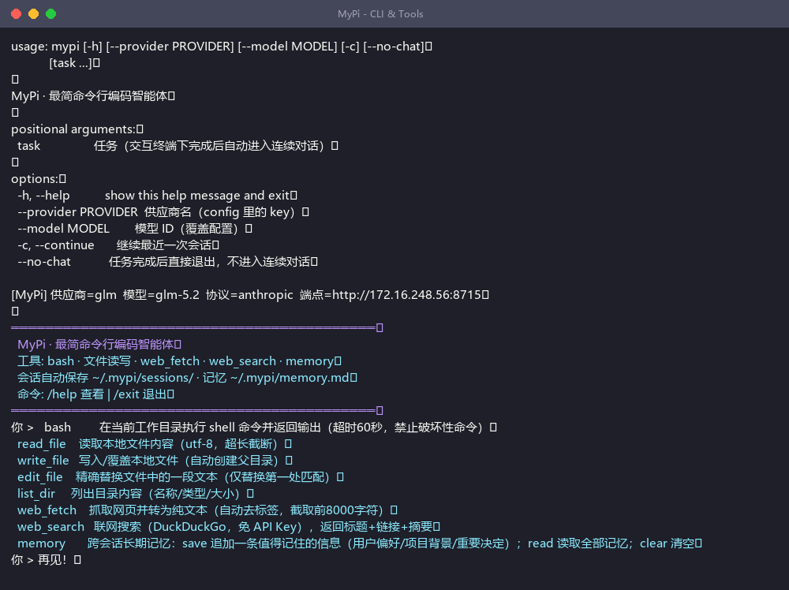
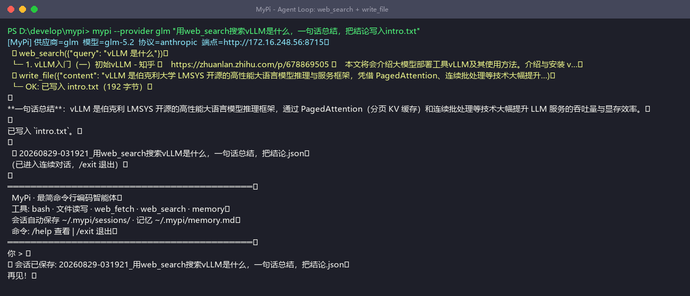
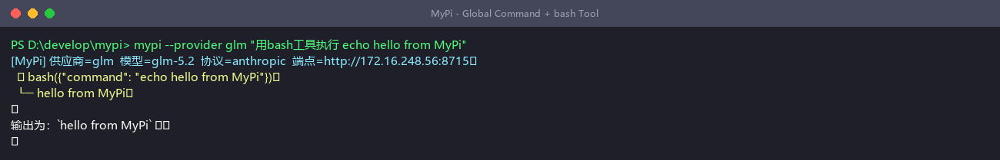
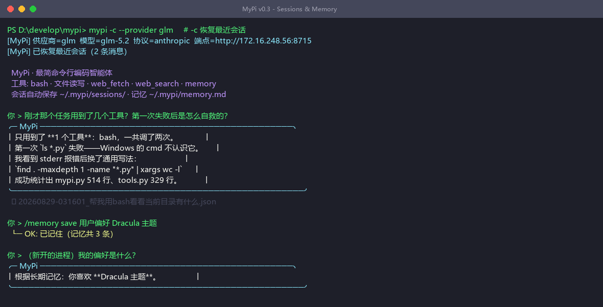

# MyPi · 最简命令行编码智能体

> 模仿 [Pi](https://github.com/badlogic/pi-mono) 的核心功能，用 **一个主文件 + 一个工具文件**（约 500 行）实现的命令行 AI Agent。配置好模型参数，命令行敲 `mypi` 就能用。

## 📸 实机演示

| CLI 与工具清单 | Agent 循环：联网搜索 + 写文件 |
|---|---|
|  |  |

| 全局命令 + bash 工具 | 会话恢复 + 跨会话记忆（v0.3） |
|---|---|
|  |  |


## ✨ 功能

- 🔄 **Agent 循环**：模型可多轮调用工具，直到完成任务；`maxRounds` 可配（0=不限制）
- 💬 **连续对话**：单次任务跑完后自动进入 REPL 追问（管道/脚本场景不干扰）
- 💾 **会话持久化**：自动存档 `~/.mypi/sessions/`，`mypi -c` 续聊、`/sessions` `/load` 管理
- 🧠 **跨会话记忆**：`memory` 工具 + `~/.mypi/memory.md` 自动注入系统提示词
- 🎨 **rich 富界面**：Markdown 面板 / 加载动画 / 彩色工具行（未安装自动降级纯文本）
- 🖥️ **双协议**：同时支持 OpenAI（`/chat/completions`）与 Anthropic（`/v1/messages`）协议，vLLM / GLM / 任何兼容端点都能接
- 🛠️ **8 个内置工具**：

| 工具 | 说明 |
|------|------|
| `bash` | 执行 shell 命令（60s 超时，内置破坏性命令过滤） |
| `read_file` / `write_file` / `edit_file` | 文件读取 / 写入 / 精确替换 |
| `list_dir` | 目录浏览 |
| `web_fetch` | 抓取网页转纯文本（自动去标签，截断保护） |
| `web_search` | DuckDuckGo 联网搜索，免 API Key |
| `memory` | 跨会话长期记忆（save / read / clear，存 `~/.mypi/memory.md`） |

## 🚀 快速开始

```bash
pip install requests

# 1. 生成并编辑配置（填入你的 baseUrl / apiKey / model）
python mypi.py            # 首次运行自动生成 ~/.mypi/config.json

# 2. 交互使用
python mypi.py
你 > 帮我搜一下 vLLM 最新版本号，然后写进 version.txt

# 3. 单次任务
python mypi.py "用 web_fetch 看看 https://example.com 是什么网站"
```

### 让 `mypi` 成为全局命令

把 `mypi.cmd` 所在目录加入 PATH（或复制到任一 PATH 目录），之后任意位置敲：

```bash
mypi                    # REPL
mypi "今天有什么科技新闻？"
mypi --provider glm     # 切换供应商
```

## ⚙️ 配置说明（`~/.mypi/config.json`）

```json
{
  "maxRounds": 0,
  "providers": {
    "autodlgpu": {
      "baseUrl": "http://localhost:8000/v1",   // OpenAI 协议端点（vLLM）
      "apiKey": "EMPTY",
      "api": "openai",                          // openai | anthropic
      "model": "gemma-4-12b"
    },
    "glm": {
      "baseUrl": "http://your-host:8715",       // Anthropic 协议端点
      "apiKey": "sk-xxx",
      "api": "anthropic",
      "model": "glm-5.2"
    }
  },
  "defaultProvider": "autodlgpu"
}
```

- **maxRounds**：单次任务的工具循环轮数上限，`0` = 不限制（默认）。设正数可在模型陷入循环时自动刹车

- **api 字段**决定请求格式：`openai` 走 `/chat/completions` + `tools`；`anthropic` 走 `/v1/messages` + `tool_use/tool_result`
- baseUrl 不要重复写 `/v1` 以外的路径，代码会自动拼接

## 💬 REPL 内置命令

```
/help     帮助          /reset    清空对话
/provider 查看或切换供应商 /model   查看或切换模型
/tools    列出工具       /exit     退出
```

## 📁 项目结构

```
mypi/
├── mypi.py               # 核心：配置加载 + Agent 循环 + 双协议客户端 + REPL
├── tools.py              # 8 个工具 + TOOL_SCHEMAS + execute_tool()
├── mypi.cmd              # Windows 全局命令包装
├── config.example.json   # 配置示例
└── requirements.txt      # requests + rich（未装 rich 自动降级纯文本）
```

## 💾 会话与记忆

```bash
mypi -c                    # 继续最近一次会话
mypi -c --provider glm     # 指定供应商续聊
```

- 每轮对话自动存档到 `~/.mypi/sessions/`，REPL 里 `/save` `/sessions` `/load <序号>` 管理
- `~/.mypi/memory.md` 是跨会话记忆文件：会话开始自动注入系统提示词，模型用 `memory` 工具追加
- 单次任务 `mypi "任务"` 在交互终端下完成后自动进入连续对话；`--no-chat` 或管道场景直接退出

## 🧠 设计思路（为什么只有两个文件）

```
用户输入 ──► Agent 循环 ──► LLM（OpenAI/Anthropic 二选一）
                ▲                    │
                │  tool_calls        │ 文本 / tool_calls
                ▼                    ▼
          execute_tool() ◄── tools.py（bash/文件/网络）
                │
                └──► 结果回填消息历史，继续下一轮
```

- **统一消息格式**：内部只有 `system/user/assistant/tool` 四种消息，协议差异在客户端层消化
- **工具即插件**：`TOOL_SCHEMAS` + `execute_tool` 两个导出点，加工具只需各加一段
- **永远不抛异常**：工具错误以字符串返回给模型，让模型自己看到错误并自我纠正

## ⚠️ 安全提示

- `bash` 工具内置了常见破坏性命令过滤（`rm -rf` 等），但**任何 LLM 驱动的 shell 都有风险**，生产环境请在沙箱/容器中运行
- apiKey 存于本地明文配置，请勿将 `~/.mypi/` 提交到仓库

## 📄 License

MIT
